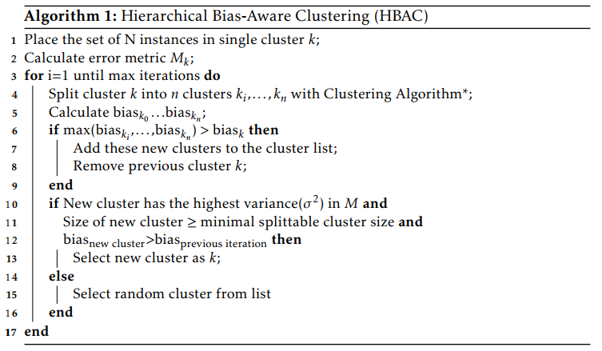

# Hierarchical Bias-Aware Clustering (HBAC)

## Problem Statement
In this project, we will apply the HBAC algorithm on the output of a classification algorithm to identify clusters with a high discriminating or favouring bias. The purpose of this research is to investigate which errors occur disproportionately more for a single or multiple groups of persons when compared to other groups in the dataset. A high discriminating bias. This discriminating bias could indicate that the classification algorithm underperforms, and therefore discriminates against these groups. 

---

### 1. Exploratory Data Analysis (EDA)
We begin by exploring the raw dataset. The dataset distribution is investigated as well as visually inspected. 

### 2. Data Transformation
Then, we preprocess the dataset by handling missing values and transforming categorical features into numerical values. We transform the categorical attributes to numerical arrays with one-hot encodings. 

### 3: Applying the Classification Algorithm  
We apply a simple classification model on the data to obtain the classification errors. In this project, we used the RandomForestClassifier algorithm from Scikit-Learn, but you could use a classifier of choice. The generated results of the classifier on the test set will serve as the HBAC dataset. 
The input for the HBAC should have the following components:
- The test data in a Pandas DataFrame: the instances with their features 
- The ground truth labels (for a classification model) or numeric values (for a regression model)
- The predicted class of the classifier per instance
- The errors of the model per instance, which can be calculated from (truth label - predicted label) per instance. All the errors should be indicated by a '1', and all the correct predictions with a '0'.

### 4. Adding the errors as a new feature to the HBAC dataset
Then, we add these errors as a new feature to the dataset. This error feature helps with forming clusters based on the classifier's performance. For more information about the rationale behind including errors as a feature, see Chapter 4, Methodology of my thesis or the article on Amsterdam Intelligence.

### 5. Feature Scaling
We scale all the features including the error feature. This step requires attention, since the feature scaling highly affects the clustering space. Particularly, the error feature can be manipulated to isolate clusters of instances with errors. See the Methodology and the Discussion chapters for some pointers about how to scale the features. 

### 6: Hierarchical Bias-Aware Clustering (HBAC)
We apply the HBAC algorithm on the dataset. We have three different clustering algorithms which can be used for HBAC: K-Means, MeanShift and DBSCAN. From our preliminary results, K-Means turned out to be the most effective clustering technique for HBAC, so we recommend using HBAC-KMeans. 

We formulate a bias metric to calculate the bias per cluster and to identify the cluster(s) with the highest discrimination bias. 
The bias metric is the following: 
Bias of Cluster X = Performance Metric(Cluster X) - Performance Metric(all Clusters\Cluster X)
In our case, we used Accuracy, but many other performance metrics can be used as well. Essentially, any performance metric that uses the errors of the classifier can be used, such as Precision, Recall and F1-score. 

### 7. Analysing the biased clusters
We used the following methods to investigate the instances in the clusters with the highest discrimination bias:
* A statistical test to determine whether the difference in average feature values between the discriminated and remaining clusters was significant; 
* Parallel Coordinate plots that show the contrast between the average features values of the discriminated and remaining clusters;
* Density distribution plots which also show the differences in data distributions for each feature separately between the biased and remaining clusters. 

--- 

## Additional Materials on Bias and Fairness
Articles and books:
* My thesis: [Auditing Algorithmic Fairness with Unsupervised Bias Discovery](https://drive.google.com/file/d/1O-zaLDryiO7uo4XTGqd7BifFCpkIGBEb/view "Auditing Algorithmic Fairness with Unsupervised Bias Discovery") 
* A Blogpost on the HBAC algorithm on [Amsterdam Intelligence](https://www.amsterdamintelligence.com/posts "Amsterdam Intelligence Blogpost")
* The main inspiration behind this study: [the Bias-Aware Hierarchical K-Means Clustering proposed by Misztal-Radecka and Indurkhya](https://bit.ly/3lcfiBq "Bias-Aware Hierarchical K-Means Clustering")
* [Meta review on algorithmic fairness](https://www.researchgate.net/profile/Ninareh-Mehrabi/publication/335420210_A_Survey_on_Bias_and_Fairness_in_Machine_Learning/links/5dcafbf092851c818049e208/A-Survey-on-Bias-and-Fairness-in-Machine-Learning.pdf "A Survey on Bias and Fairness in ML")
* A comprehensive and insightful book on fairness by Fairness experts: [The Fair ML book](https://fairmlbook.org/ "Fair ML Book")
* Interesting chapter on Fairness in [The Big Data and Social Science book](https://textbook.coleridgeinitiative.org/chap-bias.html "Fairness & Bias chapter") 

Tools:
* Google's [What-If Tool](https://pair-code.github.io/what-if-tool/ "What-If Tool")
* [IBM's](https://aif360.mybluemix.net/ "AI Fairness 360") open-source toolkit with methods to assess fairness;
* Aequitas, [an open-source bias audit toolkit](http://aequitas.dssg.io/ "Aequitas")

Tutorials:
* An extensive hands-on tutorials on [Fairness](https://dssg.github.io/fairness_tutorial/ "DSSG Tutorial") 
* An introduction on [classification bias](https://github.com/pyladiesams/classification-bias-beginner-apr2021 "Classification Bias for Beginners") by dr. Emma Beauxis-Aussalet and PyLadies
 
