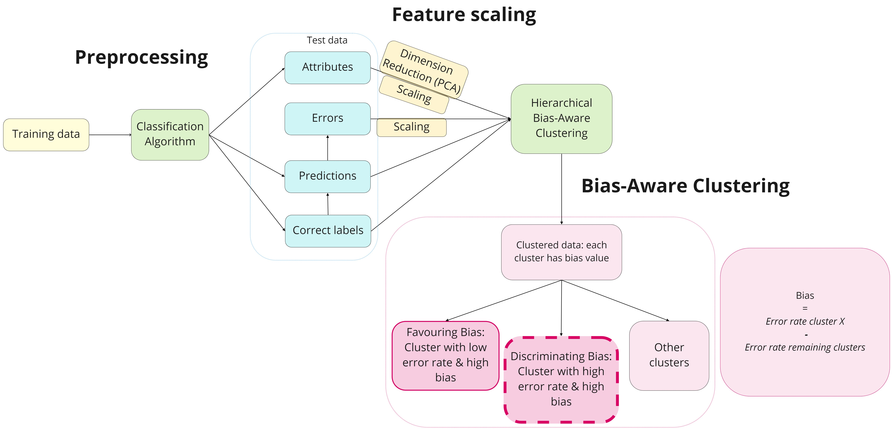

# General Approach and Current Progress

# Problem Statement
In this Jupyter Notebook, we will apply a K-Means Clustering algorithm hierarchically on the output of a classification algorithm to identify clusters with a high bias. The purpose of this research is to investigate which errors occur disproportionately more in clusters comprising instances with demographic attributes, such as age, gender and income. This could indicate that the classification algorithm underperforms for these groups, hereby indicating discriminating behaviour.

Furthermore, this study is inspired by the following paper: https://bit.ly/3g2pAmT (the Bias-Aware Hierarchical K-Means Clustering algorithm). 

We will start with a small "proof-of-concept", where we apply K-Means clustering on the test data generated from a Wine dataset.

### 1. Exploratory Data Analysis (EDA)
We begin by exploring the raw dataset which will be first fed to a classifier (which takes place at the third step) and then to the clustering algorithm (fourth step). The dataset distribution is investigated as well as visually inspected. 

### 2. Preprocessing 
Then, we preprocess the dataset by handling missing values and transforming categorical features into numerical values. One of the options we investigate is one-hot encoding the categorical features.

### 3: Applying the Classification Algorithm  
We apply a simple classification model on the data to obtain the classification errors. Here, we use the RandomForestClassifier algorithm from SciKit. Then, we add the errors as a new feature to the dataset.
The generated results on the test set will serve as input for step 4. Thus, we export the generated results to a csv-file. 

### 4: Bias-Aware Hierarchical K-Means (BAH-KM)
First, all the features, except for the predictions, ground truth labels and the errors, are scaled. After scaling, the Bias-Aware Hierarchical KMeans algorithm can be applied on the classification results. 

The input for the clustering algorithm has the following components:
- The test data in a Pandas DataFrame: the instances with their features 
- The ground truth labels (for a classification model) or values (for a regression model)
- The predicted class of the classifier per instance
- The errors of the model per instance, which can be calculated from (truth label - predicted label) per instance

We formulate a bias metric to calculate the bias per cluster and to identify the cluster(s) with the highest bias. 
The bias metric is the following:
Bias of Cluster X = Performance Metric(Cluster X) - Performance Metric(all Clusters\Cluster X)

Where the performance metric is Macro F-score. This will later be replaced by the Weighted F-score.

The output of the Bias-Aware algorithm is/are the cluster(s) with the highest bias. This will we exported to a csv-file. 

### 5. Identifying Patterns in Biased Clusters
Several methods will be applied to identify the patterns in the biased clusters. We will inspect which features and which values of the features occurred most. 

<!-- Format:  -->
-----
<!-- C:\Users\Gebruiker\Documents\thesiscode\experimental\Images\Bias_Workflow.jpg -->

Updates/open issues:
- Filling in the EDA, Preprocessing, Classification and cluster analysis notebooks.
- Errors in the F-score function: sometimes the Precision/Recall/F-score yield a "division by zero" error. 
- Errors within the BAH-KM algorithm loop (see 4_bias_aware_clustering). It shows: "UserWarning: Boolean Series key will be reindexed to match DataFrame index." Also, it doesn't break out of the loop and return the biased cluster. It seems that it keeps calculating the bias on an empty dataframe...
- Weighted F-score instead of Macro F-score
 - Cleaning up the code and renaming the variables to increase the readability 
 - Including the errors when clustering (currently, I've kept them separate but I will add them once all the code in 4_bias_aware_clustering works.)